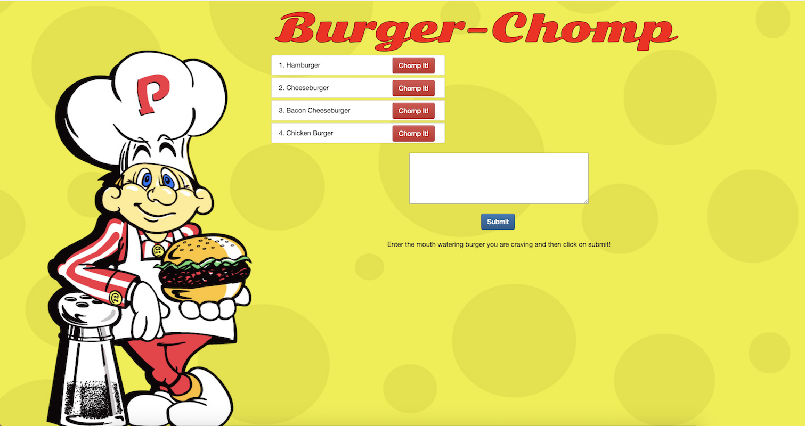

# burger



## What Is It?

Burger Chomp is a burger logger application created using MySQL, Node, Express and Handlebars.

## How Does It Work?

* Burger Chomp is a restaurant application that lets users input the names of burgers they'd like to eat.

* Whenever a user submits a burger's name, the app will display the burger on the left side of the page -- waiting to be devoured.

* Each burger in the waiting area also has a `Chomp It!` button. When the user clicks it, the burger will move to the "chomped" side of the page.

* The application stores every burger in the database, whether devoured or not.

## How Do I Use It?

### Using Heroku

The application is hosted on Heroku and can be accessed by clicking on the following link [Burger Chomp](https://burger-chomp.herokuapp.com/)

### On Your Local Machine

Execute the following steps to setup and run the application on your local machine.

1. Clone this repository to your machine and then run ```npm install```.
2. Launch the database GUI of your choice, i.e. Sequel Pro, and run the ```burger/db/schema.sql``` file.  Then, run ```/burger/db/seeds.sql```.
3. Update the user and password in the ```burger/config/connection.js``` if necessary.
4. Run ```node server``` or ```nodemon server``` from the ```burger``` directory.
5. Point your browser to ```http://localhost:3000```

## Under The Hood

The application uses a MySQL database to store the burger data and Node.js as the backend.  Express is used as the application server and Handlebars as the web template system.  Below is a list of all Node packages used:

* [express](https://www.npmjs.com/package/express)
* [method-override](https://www.npmjs.com/package/method-override)
* [body-parser](https://www.npmjs.com/package/body-parser)
* [path](https://nodejs.org/api/path.html)
* [mysql2](https://www.npmjs.com/package/mysql2)

## Error Handling

Empty burger names are not allowed.
